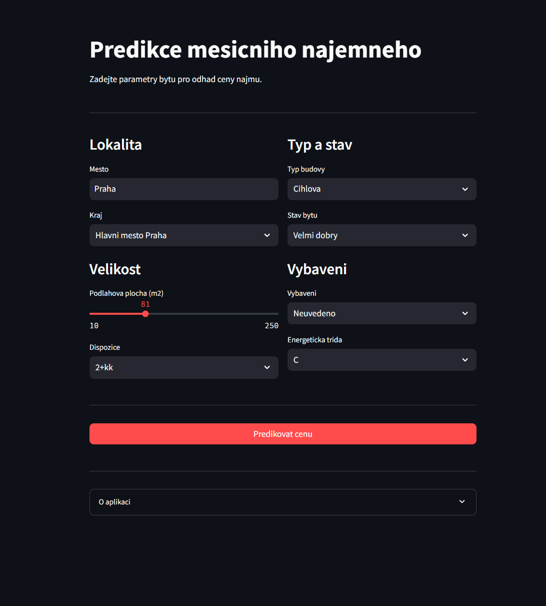

# Predikce Najemneho Bytu v CR

Predikce mesicniho najemneho bytu pomoci XGBoost. REST API (FastAPI) + webova aplikace (Streamlit).



## Technologie

- **XGBoost** - predikce ceny (GPU)
- **FastAPI** - REST API s Prometheus metrikami
- **Streamlit** - webove rozhrani
- **Optuna** - optimalizace hyperparametru

## Vysledky

| Model | MAE |
|-------|-----|
| XGBoost + Optuna | ~2 700 Kc |

## Spusteni

```bash
# Instalace
conda env create -f environment.yml
conda activate estate
pip install -e .

# Trenovani modelu
python scripts/train_pipeline.py --optimize --trials 50

# API (port 8000)
uvicorn src.api.main:app --reload

# Streamlit (port 8501)
streamlit run huggingface_app/app.py
```

## API Endpointy

| Endpoint | Popis |
|----------|-------|
| `POST /predict` | Predikce ceny |
| `POST /predict/explain` | Predikce + SHAP |
| `GET /health` | Stav API |
| `GET /metrics` | Prometheus metriky |

Swagger: http://localhost:8000/docs

## Struktura

```
src/
├── api/           # FastAPI
├── data/          # Loader, preprocessing
├── models/        # Train, predict
└── evaluation/    # Metriky

scripts/
└── train_pipeline.py

huggingface_app/
└── app.py         # Streamlit
```

---

# Czech Apartment Rent Prediction

Monthly rent prediction using XGBoost. REST API (FastAPI) + web app (Streamlit).

## Tech Stack

- **XGBoost** - price prediction (GPU)
- **FastAPI** - REST API with Prometheus metrics
- **Streamlit** - web interface
- **Optuna** - hyperparameter optimization

## Results

| Model | MAE |
|-------|-----|
| XGBoost + Optuna | ~2 700 CZK |

## Quick Start

```bash
# Install
conda env create -f environment.yml
conda activate estate
pip install -e .

# Train model
python scripts/train_pipeline.py --optimize --trials 50

# API (port 8000)
uvicorn src.api.main:app --reload

# Streamlit (port 8501)
streamlit run huggingface_app/app.py
```

## API Endpoints

| Endpoint | Description |
|----------|-------------|
| `POST /predict` | Price prediction |
| `POST /predict/explain` | Prediction + SHAP |
| `GET /health` | API status |
| `GET /metrics` | Prometheus metrics |

Swagger: http://localhost:8000/docs

## Project Structure

```
src/
├── api/           # FastAPI
├── data/          # Loader, preprocessing
├── models/        # Train, predict
└── evaluation/    # Metrics

scripts/
└── train_pipeline.py

huggingface_app/
└── app.py         # Streamlit
```

---

**Dataset:** ~20 000 apartments from Czech real estate portals
