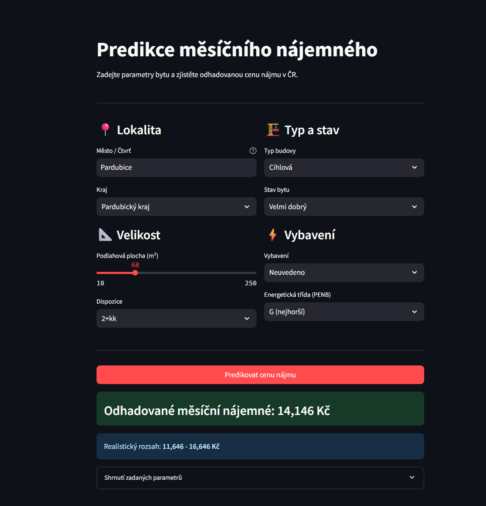

# Predikce Nájemného Bytů v ČR

Projekt pro predikci měsíčního nájemného bytů v České republice pomocí strojového učení.



## O projektu

Model predikuje měsíční nájemné na základě charakteristik bytu - lokality, velikosti, stavu, vybavení a dalších parametrů. Dataset obsahuje ~20 000 záznamů z českých realitních portálů.

## Výsledky modelů

| Model | MAE (Kč) |
|-------|----------|
| **XGBoost + Optuna** | **2 741** |
| MLP (Neural Network) | 3 319 |
| CNN | 3 772 |

*MAE = Mean Absolute Error (průměrná absolutní chyba predikce)*

**Nejlepší model:** XGBoost s Optuna hyperparameter tuningem dosahuje MAE ~2 741 Kč.

## Vstupní parametry modelu

- **Lokalita**: město, kraj
- **Velikost**: podlahová plocha (m²), dispozice (1+kk, 2+1, ...)
- **Stav**: novostavba, po rekonstrukci, dobrý stav, ...
- **Vybavení**: zařízeno / částečně / nezařízeno
- **Energetická třída**: PENB (A-G)
- **Typ budovy**: cihlová, panelová, ...

## Použité technologie

- **XGBoost** - Gradient boosting model
- **TensorFlow/Keras** - Neuronové sítě (MLP, CNN)
- **Optuna** - Optimalizace hyperparametrů
- **Scikit-learn** - Preprocessing
- **Streamlit** - Webová aplikace
- **SHAP** - Interpretace modelu

## Struktura projektu

```
EstateShowCase/
├── data/                       # Dataset (není v repo)
├── models/                     # Uložené modely
│   ├── xgboost.json
│   ├── multilayer_perceptron.keras
│   └── convolutional_neural_network.keras
├── huggingface_app/            # Streamlit aplikace
│   ├── app.py
│   ├── requirements.txt
│   └── models/
├── prediction_model.ipynb      # Hlavní notebook
└── README.md
```

## Spuštění aplikace lokálně

```bash
cd huggingface_app
pip install -r requirements.txt
streamlit run app.py
```

## Budoucí vývoj

- Nasazení modelu do cloudu (Hugging Face Spaces / Streamlit Cloud)
- REST API pro integraci do jiných aplikací

---

**Autor:** Tomáš
**Poslední aktualizace:** Leden 2026
